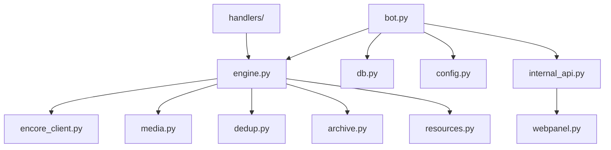

# Module Dependencies

```mermaid
graph TD
    bot[bot.py] --> engine[engine.py]
    bot --> db[db.py]
    bot --> config[config.py]
    bot --> internal_api[internal_api.py]
    engine --> encore[encore_client.py]
    engine --> media[media.py]
    engine --> dedup[dedup.py]
    engine --> archive[archive.py]
    engine --> resources[resources.py]
    internal_api --> webpanel[webpanel.py]
    handlers[handlers/] --> engine
```
